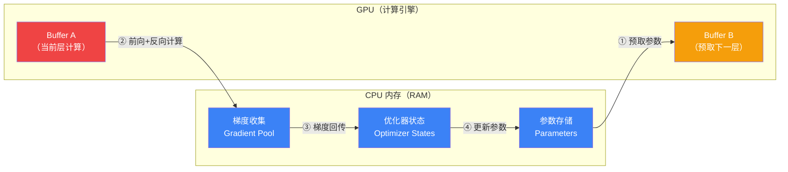

# 🚀 MegaTrain 中文实战指南

**一张 GPU + 足够的 RAM = 训 120B 大模型。MegaTrain 让穷人也能玩大模型。**

[](https://arxiv.org/abs/2604.05091)
[](https://github.com/DLYuanGod/MegaTrain)
[](https://github.com/DLYuanGod/MegaTrain/blob/main/LICENSE)

> **全网首发中文实战指南** | 原始论文：[arXiv 2604.05091](https://arxiv.org/abs/2604.05091) | 代码：[GitHub](https://github.com/DLYuanGod/MegaTrain) | [HN 讨论 (253pts)](https://news.ycombinator.com/item?id=47689174)

---

## 📖 目录

- [为什么你该关注 MegaTrain](#-为什么你该关注-megatrain)
- [核心原理](#-核心原理)
- [硬件选购指南](#-硬件选购指南)
- [快速上手教程](#-快速上手教程)
- [性能对比](#-性能对比)
- [支持模型速查表](#-支持模型速查表)
- [常见问题 FAQ](#-常见问题-faq)
- [引用](#-引用)

---

## 🔥 为什么你该关注 MegaTrain

传统大模型训练需要多卡甚至多机并行（一台 8×A100 机器动辄百万），MegaTrain 换了个思路：

> **GPU 只是计算引擎，参数存在 CPU 内存里。**

| 传统方式 | MegaTrain |
|---------|-----------|
| 参数放 GPU 显存 | 参数放 CPU 内存（RAM） |
| 120B 模型需要 8+ 块 A100 | 120B 模型只需 **1 块 H200 + 1.5TB RAM** |
| DeepSpeed ZeRO-3 + CPU offload | **比 ZeRO-3 快 1.84 倍**（14B 模型） |
| 多卡通信开销大 | 零通信开销（就一块卡） |

**一句话：以前需要一个机柜的工作，现在一台工作站搞定。**

---

## 🧠 核心原理

### RAM-Centric 架构



### 两大核心优化

#### 1. 流水线双缓冲（Pipelined Double Buffering）

GPU 有两个缓冲区，像流水线一样工作：

```
时间 →  ────────────────────────────────────
Buffer A:  [计算 Layer 1] [计算 Layer 2] [计算 Layer 3]
Buffer B:  [预取 Layer 2] [预取 Layer 3] [预取 Layer 4]
梯度回传:              [回传 L1]  [回传 L2]  [回传 L3]
────────────────────────────────────

关键：GPU 在计算当前层时，下一层参数已经在路上了 → CPU↔GPU 带宽被完全利用
```

#### 2. 无状态层模板（Stateless Layer Templates）

传统 PyTorch 的 autograd 会保存完整的计算图（很占内存）。MegaTrain 用**无状态模板**替代：

- 每层共享同一个计算模板
- 权重在流入时动态绑定
- 计算完立即释放，不保留图元数据
- 结果：**GPU 显存占用大幅降低**

---

## 💰 硬件选购指南

### 本地方案

| 预算档 | GPU | GPU 显存 | CPU RAM | 可训模型 | 预估价格 (RMB) | 推荐场景 |
|--------|-----|---------|---------|---------|---------------|---------|
| 🟢 入门 | RTX 4090 | 24GB | 128GB | ~14B | ¥15,000 | 学习入门、微调 7B |
| 🟡 进阶 | A100 (PCIe) | 80GB | 512GB | ~70B | ¥80,000 | 中型模型全参训练 |
| 🔴 极限 | H200 (SXM) | 141GB | 1.5TB | ~120B | ¥200,000+ | 100B+ 旗舰模型 |
| 🟣 性价比 | RTX 5090 | 32GB | 256GB | ~27B | ¥25,000 | Qwen3.5-27B 甜品档 |

> 💡 **关键公式**：可训模型大小 ≈ CPU RAM ÷ 20（bf16 参数 + 优化器状态 + 梯度缓冲）

### 内存选购建议

| 模型大小 | 最小 RAM | 推荐 RAM | 说明 |
|---------|---------|---------|------|
| 7-8B | 64GB | 128GB | DDR5 即可 |
| 14B | 128GB | 192GB | 单条 32GB×4 或 48GB×4 |
| 27-32B | 256GB | 384GB | 需要服务器主板 |
| 70B | 512GB | 768GB | RDIMM ECC 推荐 |
| 120B | 1TB | 1.5TB | 仅 EPYC/Xeon 平台支持 |

### ☁️ 云端方案对比

| 平台 | GPU 型号 | 显存 | RAM | 价格/小时 | 适合训练 | 备注 |
|------|---------|------|-----|----------|---------|------|
| **AutoDL** | A100 80GB | 80GB | 200GB | ¥8-12/h | ≤32B | 🇨🇳 国内首选，带宽好 |
| **AutoDL** | H800 | 80GB | 400GB | ¥25-35/h | ≤70B | 需抢实例 |
| **阿里云 PAI** | A100 80GB | 80GB | 512GB | ¥30-50/h | ≤70B | 企业用户友好 |
| **Lambda Labs** | H100 80GB | 80GB | 200GB | $2.49/h | ≤32B | 🇺🇸 海外首选 |
| **Lambda Labs** | H200 | 141GB | 1.5TB | $5.49/h | ≤120B | 需排队 |
| **Vast.ai** | A100/H100 | 80GB | 按需 | $1.5-4/h | 按配置 | 社区GPU市场，价格浮动 |

> ⚠️ **重要提示**：云端实例的 RAM 上限可能比标称值低（系统占用），建议选比需求大 20% 的配置。

### 关键硬件要点

1. **CPU ↔ GPU 带宽是瓶颈** — 尽量用 PCIe 5.0 或 NVLink
2. **RAM 速度影响训练速度** — DDR5-4800 比 DDR4-3200 快 ~40%
3. **NVMe SSD 用于数据加载** — 训练数据放 SSD，不要放 HDD
4. **ECC 内存推荐** — 长时间训练（几天）用 ECC 避免位翻转

---

## 🛠️ 快速上手教程

### Step 1: 环境配置

```bash
# 基础环境（推荐 Python 3.10+，PyTorch 2.3+）
conda create -n megatrain python=3.10
conda activate megatrain

# 安装 PyTorch（国内镜像加速）
pip install torch torchvision torchaudio -i https://pypi.tuna.tsinghua.edu.cn/simple

# 克隆 MegaTrain
git clone https://github.com/DLYuanGod/MegaTrain.git
cd MegaTrain
pip install -e . -i https://pypi.tuna.tsinghua.edu.cn/simple

# 可选加速组件（强烈推荐）
pip install flash-attn                          # Flash Attention（需要 CUDA 11.8+）
pip install deepspeed                           # DeepSpeed CPUAdam（优化器加速 5-7x）
pip install flash-linear-attention causal-conv1d # Qwen3.5 线性注意力支持
```

#### 国内下载加速

```bash
# HuggingFace 模型下载加速（设置镜像）
export HF_ENDPOINT=https://hf-mirror.com

# 或者用 modelscope 下载后转 HF 格式
pip install modelscope
modelscope download --model Qwen/Qwen2.5-7B --local_dir ./models/qwen2.5-7b
```

### Step 2: 第一次训练 — Qwen2.5-7B Demo

```bash
# 使用内置 demo 数据，最小配置测试
python examples/train.py --config examples/configs/qwen_7b.yaml
```

`qwen_7b.yaml` 大致内容：

```yaml
model:
  name: "Qwen/Qwen2.5-7B"
  dtype: "bfloat16"
  attn_implementation: "flash_attention_2"

dataset:
  name: "alpaca_en_demo"     # 内置 demo 数据
  dataset_dir: "data"
  max_seq_len: 1024

training:
  batch_size: 32             # ⚠️ 必须用 calc_resource.py 计算！
  num_steps: 100
  learning_rate: 1.0e-5

optimizer:
  type: "deepspeed_adam"     # 比 PyTorch AdamW 快 5-7x
```

### Step 3: 计算你的最优 batch_size

> ⚠️ **官方警告：不要猜 batch_size！** 错误的 batch_size 会导致 OOM 或浪费 GPU。

```bash
python scripts/calc_resource.py
# 交互式输入：
#   GPU 显存: 24 (GB)
#   CPU RAM: 128 (GB)
#   模型: Qwen/Qwen2.5-7B
#   序列长度: 1024
# 输出推荐的 batch_size
```

### Step 4: 进阶 — Qwen3.5-27B 混合注意力训练

```bash
# 确保安装了线性注意力支持
pip install flash-linear-attention causal-conv1d

# 使用 MetaMathQA 数学数据集训练
python examples/train.py --config examples/configs/qwen3_5_27b.yaml
```

```yaml
# qwen3_5_27b.yaml
model:
  name: "Qwen/Qwen3.5-27B"
  dtype: "bfloat16"
  attn_implementation: "flash_attention_2"
  trust_remote_code: true

dataset:
  name: "metamath"           # MetaMathQA 数学推理数据
  max_seq_len: 2048

training:
  batch_size: 16             # 27B 模型需要更多内存，batch 要小
  num_steps: 500
  learning_rate: 1.0e-5
  checkpoint_interval: 4     # 每 4 层做一次梯度检查点

optimizer:
  type: "deepspeed_adam"
```

### Step 5: 自定义数据集

```bash
# 1. 准备 alpaca 格式 JSON
cat > data/my_data.json << 'EOF'
[
  {
    "instruction": "解释什么是 Transformer",
    "input": "",
    "output": "Transformer 是一种基于自注意力机制的神经网络架构..."
  },
  {
    "instruction": "用 Python 写一个快速排序",
    "input": "",
    "output": "def quicksort(arr):\n    if len(arr) <= 1:\n        return arr\n    ..."
  }
]
EOF

# 2. 注册到 dataset_info.json
cat > data/dataset_info.json << 'EOF'
{
  "my_data": {
    "file_name": "my_data.json",
    "formatting": "alpaca"
  }
}
EOF

# 3. 修改配置文件中的 dataset.name 为 "my_data"
```

---

## 📊 性能对比

### 训练速度（数据来自论文）

| 方法 | 14B 模型 | 相对速度 | 内存需求 | 是否需要多卡 |
|------|---------|---------|---------|------------|
| **MegaTrain** | 基准 (1.0x) | 🏆 **最快** | 低（参数在 RAM） | ❌ 单卡 |
| DeepSpeed ZeRO-3 (CPU offload) | 0.54x | 慢 1.84 倍 | 高 | ❌ 单卡但慢 |
| PyTorch FSDP | 需要多卡 | — | 高 | ✅ 必须多卡 |
| Megatron-LM | 需要多卡 | — | 高 | ✅ 必须多卡 |

### 为什么 MegaTrain 比 ZeRO-3 快？

| 优化点 | ZeRO-3 CPU Offload | MegaTrain |
|--------|-------------------|-----------|
| 参数传输 | 全部参数每步搬运 | 双缓冲流水线，传输和计算重叠 |
| 计算图 | 完整 autograd 图 | 无状态模板，零图元数据 |
| 优化器 | 标准 AdamW | DeepSpeed CPUAdam (SIMD 加速) |
| 调度 | 粗粒度调度 | 逐层细粒度流水线 |

### 模型规模 vs 硬件需求

| 模型大小 | 最小 GPU 显存 | 最小 CPU RAM | 训练速度参考 |
|---------|-------------|-------------|------------|
| 7-8B | 16GB | 64GB | ~50 tokens/s |
| 14B | 24GB | 128GB | ~25 tokens/s |
| 27-32B | 32GB | 256GB | ~12 tokens/s |
| 70B | 80GB | 512GB | ~4 tokens/s |
| 120B | 141GB (H200) | 1.5TB | ~1.5 tokens/s |

> 📌 速度数据为估算值，实际取决于序列长度、batch_size、硬件带宽等因素。

---

## 📋 支持模型速查表

### 🇨🇳 中文模型（重点推荐）

| 模型 | 大小 | 架构 | 推荐场景 | 备注 |
|------|------|------|---------|------|
| **Qwen2/Qwen2.5** | 0.5B-72B | Dense | 通用中文、代码 | ⭐ 中文最强开源 |
| **Qwen3** | 0.6B-32B | Dense | 通用、推理 | 最新一代 |
| **Qwen3.5** | 0.8B-27B | Hybrid (线性+全注意力) | 长文本、推理 | 🔥 混合注意力新架构 |
| **Qwen3.5 MoE** | 35B-397B | Hybrid + MoE | 超大规模 | 顶配才能训 |
| **Qwen3-Next** | 80B-A3B | Hybrid + MoE | 高效推理 | 仅激活 3B 参数 |
| **GLM-4/GLM-4.5** | 9B/32B | Dense | 中文对话 | 清华出品 |
| **InternLM 2/2.5** | 7B/20B | Dense | 通用中文 | 上海 AI Lab |
| **Yi 1.5** | 6B-34B | Dense | 通用中文 | 零一万物 |
| **Baichuan 2** | 7B/13B | Dense | 中文、搜索 | 百川智能 |

### 🌍 国际模型

| 模型 | 大小 | 架构 | 推荐场景 |
|------|------|------|---------|
| **Llama 2** | 7B-70B | Dense | 通用英文 |
| **Llama 3/3.1/3.2/3.3** | 1B-70B | Dense | 英文最强开源 |
| **Llama 4** | Scout-17B-16E / Maverick | MoE | 下一代 Llama |
| **Mistral** | 7B | Dense | 高效小模型 |
| **Mixtral** | 8×7B / 8×22B | MoE | MoE 标杆 |
| **DeepSeek** | 7B-67B | Dense | 代码、推理 |
| **Phi-3/Phi-4** | 3.8B-14B | Dense | 小而强 |
| **Gemma 2/3** | 2B-27B | Dense | Google 出品 |
| **GPT-OSS** | 20B/120B | Dense | OpenAI 开源 |

> 💡 **通配支持**：任何 HuggingFace `AutoModelForCausalLM` 能加载的 decoder-only 模型都可以直接用，无需改代码。

---

## ❓ 常见问题 FAQ

### Q1: 训练时 OOM（Out of Memory）怎么办？

**GPU 显存 OOM：**
```yaml
# 方法 1: 减小 batch_size（最有效）
training:
  batch_size: 16  # 改小

# 方法 2: 增加梯度检查点频率
training:
  checkpoint_interval: 2  # 每 2 层做一次检查点（默认可能是 4）

# 方法 3: 缩短序列长度
dataset:
  max_seq_len: 512  # 从 1024 改到 512
```

**CPU 内存 OOM：**
- 你的 RAM 不够放模型参数 + 优化器状态
- 解决：加内存，或换更小的模型
- 规则：**RAM 至少 = 模型参数量 × 20 字节**（bf16 参数 + Adam 状态）

### Q2: Flash Attention 装不上？

```bash
# 常见原因 1: CUDA 版本不匹配
nvcc --version  # 需要 CUDA 11.8+

# 常见原因 2: 没装 ninja
pip install ninja

# 常见原因 3: GCC 版本太低
gcc --version  # 需要 GCC 7.5+

# 实在装不上？用 SDPA 替代（稍慢但兼容性好）
# 在 config 中改：
model:
  attn_implementation: "sdpa"  # 改成 sdpa，不用 flash_attention_2
```

### Q3: 数据格式怎么准备？

支持两种主流格式：

**Alpaca 格式**（推荐新手）：
```json
[
  {"instruction": "你的问题", "input": "可选输入", "output": "期望回答"},
  {"instruction": "另一个问题", "input": "", "output": "另一个回答"}
]
```

**ShareGPT 格式**（多轮对话）：
```json
[
  {
    "conversations": [
      {"from": "human", "value": "你好"},
      {"from": "gpt", "value": "你好！有什么我可以帮你的？"},
      {"from": "human", "value": "解释一下量子计算"},
      {"from": "gpt", "value": "量子计算是..."}
    ]
  }
]
```

### Q4: 训练速度太慢？

**五步加速 checklist：**

1. ✅ **用 DeepSpeed CPUAdam**（比 PyTorch AdamW 快 5-7x）
   ```yaml
   optimizer:
     type: "deepspeed_adam"
   ```

2. ✅ **装 Flash Attention**
   ```bash
   pip install flash-attn
   ```

3. ✅ **Qwen3.5 模型装线性注意力**
   ```bash
   pip install flash-linear-attention causal-conv1d
   ```

4. ✅ **增加 DataLoader workers**
   ```yaml
   dataset:
     num_workers: 4  # 默认可能是 0
   ```

5. ✅ **用 calc_resource.py 优化 batch_size**
   ```bash
   python scripts/calc_resource.py  # 找到最优值
   ```

### Q5: 能训 MoE 模型吗？

能！MegaTrain 自动检测 MoE 架构，支持：
- Mixtral 8×7B / 8×22B
- Qwen3.5 MoE (35B-A3B / 122B-A10B / 397B-A17B)
- Qwen3-Next 80B-A3B
- Llama 4 Scout / Maverick
- GLM-4.7-Flash (MoE)

MoE 模型的内存计算要注意：总参数量虽大，但单次前向只激活部分专家。

### Q6: 能做 LoRA / QLoRA 微调吗？

MegaTrain 目前专注于**全参数训练**。如果你需要 LoRA/QLoRA，推荐用：
- [LLaMA-Factory](https://github.com/hiyouga/LLaMA-Factory) — 综合训练框架
- [Unsloth](https://github.com/unslothai/unsloth) — 极致速度优化

MegaTrain 的价值在于：**当你需要全参训练但没有多卡集群时**。

---

## 📝 引用

如果 MegaTrain 对你有帮助，请引用原始论文：

```bibtex
@misc{yuan2026megatrainprecisiontraining100b,
  title={MegaTrain: Full Precision Training of 100B+ Parameter Large Language Models on a Single GPU},
  author={Zhengqing Yuan and Hanchi Sun and Lichao Sun and Yanfang Ye},
  year={2026},
  eprint={2604.05091},
  archivePrefix={arXiv},
  primaryClass={cs.CL},
  url={https://arxiv.org/abs/2604.05091},
}
```

---

## 🔗 相关资源

- [MegaTrain 原始仓库](https://github.com/DLYuanGod/MegaTrain)
- [arXiv 论文](https://arxiv.org/abs/2604.05091)
- [Hacker News 讨论](https://news.ycombinator.com/item?id=47689174)
- [LLaMA-Factory](https://github.com/hiyouga/LLaMA-Factory) — MegaTrain 的数据系统灵感来源
- [DeepSpeed](https://github.com/microsoft/DeepSpeed) — CPUAdam 优化器来源
- [Flash Attention](https://github.com/Dao-AILab/flash-attention)

---

## 🔗 更多中文 AI 实战指南

| 项目 | 简介 |
|------|------|
| [🤖 AI Agent 框架选型指南](https://github.com/Vincentwei1021/awesome-ai-agent-frameworks) | Scion/AutoGen/CrewAI/LangGraph 深度对比 + 选型决策树 |
| [📈 Kronos 中文实战指南](https://github.com/Vincentwei1021/kronos-guide-cn) | 金融 K 线基础模型 · A 股预测 · 微调 · 回测集成 |

---

## 📄 许可证

本指南采用 [MIT License](LICENSE) 开源。MegaTrain 原始代码采用 [Apache 2.0 License](https://github.com/DLYuanGod/MegaTrain/blob/main/LICENSE)。

---

<p align="center">
  <b>⭐ 如果这份指南对你有帮助，请给一个 Star！</b><br/>
  <sub>有问题或建议？欢迎 <a href="https://github.com/Vincentwei1021/megatrain-guide-cn/issues">提 Issue</a></sub>
</p>
